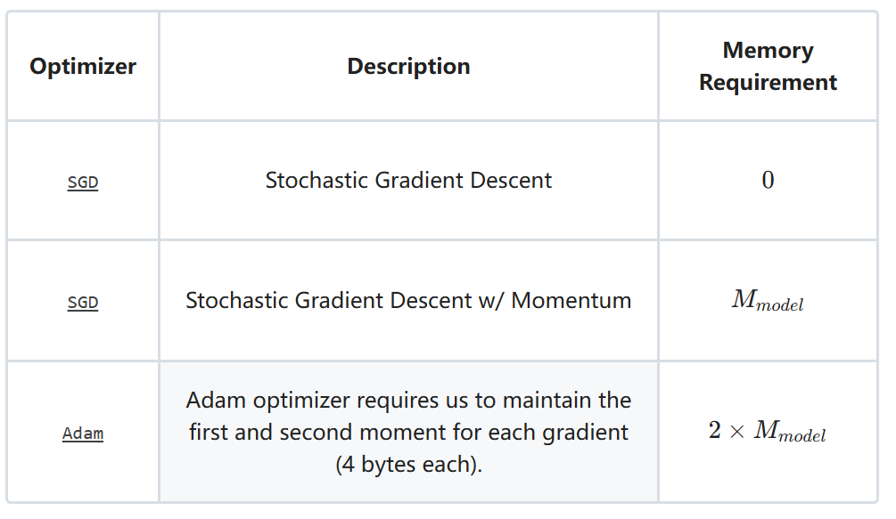
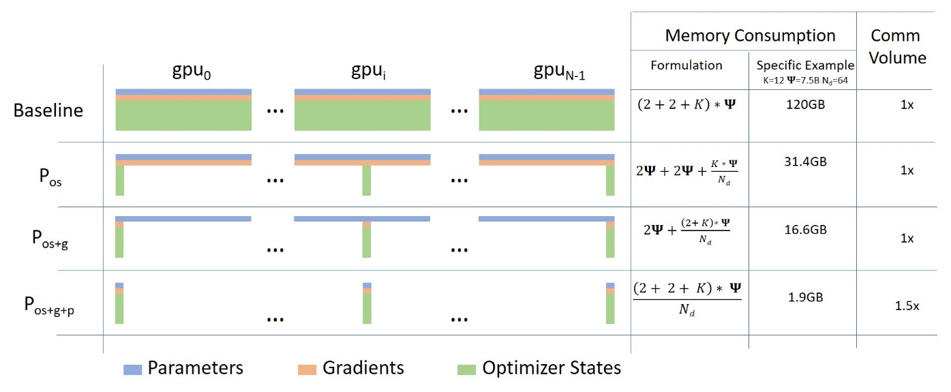

# 分布式训练
该仓库记录基于pytorch和DeepSpeed的分布式训练（Data Parallelism）的学习笔记。本实验在单机多卡上进行的，代码提供了注释，可读性强。

## 项目结构

* 进程通信基础：**communication_intro.py**,**communication.py** 
* Pytorch分布式训练
  
  **ddp_mp.py** :利用torch.multiprocessing包提供的功能启动分布式训练
  
  **ddp_torchrun.py** :利用torchrun提供的功能启动分布式训练 （推荐）

* Deepspeed分布式训练
  
## 环境

```
torch==2.1.0
deepspeed==0.16.3
```

## 基础知识


分布式训练大致分为：模型并行训练和数据并行训练，这里只记录 **数据并行** 训练方法。Pytorch支持两种分布式训练:**DataParallel (DP)** 和**DistributedDataParallel (DDP)**。前者实现简单，只需要在单卡训练模型上添加少量代码即可，但是仅支持单机多卡训练方式，训练过程中只开启一个进程，无法利用多核。多张GPUs中有一个master节点，负责汇总每张卡上的梯度并求梯度均值(master节点必须等待所有节点计算完毕)，计算模型参数后分发到每张卡上，这样会导致GPU利用不均衡等问题；后者启动多个进程，通常每个进程对应一个GPU模型，每个进程跑一份代码，每个进程独立计算模型梯度，进程之间两两通信传递地梯度，然后求梯度均值（AllReduce）。

### node, rank 


* World 是包含所有的分布式训练进程的一个组

* World_size: 组的大小（通常为process数量）

* rank：进程的标志

* local_rank: 在某一结点(node)上的进程标志

* node：节点数目

* node_rank: 节点编号

* nproc_per_node：一个节点中的进程数量，一般一个进程使用一个显卡，故也通常表述为一个节中显卡的数量；

* master_addr：master节点的ip地址，也就是 rank=0 对应的主机地址。设置该参数目的是为了让其他节点知道 0 号节点的位置，这样就可以将自己训练的参数传递过去处理；

* master_port：master节点的port号，在不同的节点上master_addr和master_port的设置是一样的，用来进行通信

当使用`torchrun`命令启动分布式训练时,上述参数会自动的被设置在环境变量`os.environ`中，`init_process_group()`函数参数`init_method="env://"`默认采用从环境变量中获取。具体实践代码在文件`ddp_torchrun.py`

**分布式训练一定要记住你写的每一行代码是在多个进程中都要跑一遍的，有些需要同步的数据（例如梯度）Pytorch已经帮我们做了，有些操作同步操作需要我们自己做！！！**

## 进程通信

`python ddp_communication_intro.py`
* dist.send() # 向指定设备发送tensor
* dist.recv() # 接收指定设备发送的tensor
* dist.all_reduce() # 将所有的设备上的值按照指定的操作（求和、均值等）聚合,并分发到所有设备上

`torchrun --nproc-per-node=2 ddp_communication.py`
* dist_scatter() # 将某设备上的多个值分发到值分发到多个设备
* dist_gather() # 将多个设备上的值汇聚到指定设备
* dist_broadcast() # 将某设备上的值复制到多个设备
* dist_reduce() # 将所有的设备上的值按照指定的操作（求和、均值）聚合到指定设备上
* dist_all_reduce() #reduce + broacaset
* dist_all_gather() #gather + broacaset
* dist_reduce_scatter() # reduce + scatter

## Pytorch分布式

###  MP
利用Pytorch提供的torch.multiprocessing 包启动多进程执行训练脚本
```bash
python ddp_mp.py --max_epochs=2 --batch_size=32

[W socket.cpp:663] [c10d] The client socket has failed to connect to [localhost]:12345 (errno: 101 - Network is unreachable).
GPU_Count: 4
GPU:0 | Epoch: 0 | Batchsize: 32 | Steps: 32
GPU:2 | Epoch: 0 | Batchsize: 32 | Steps: 32
GPU:1 | Epoch: 0 | Batchsize: 32 | Steps: 32
GPU:3 | Epoch: 0 | Batchsize: 32 | Steps: 32
GPU:0 | Epoch: 1 | Batchsize: 32 | Steps: 32
GPU:2 | Epoch: 1 | Batchsize: 32 | Steps: 32
GPU:3 | Epoch: 1 | Batchsize: 32 | Steps: 32
GPU:1 | Epoch: 1 | Batchsize: 32 | Steps: 32
```
计算： 

Batchsize\*step\*GPU_NUM = 32\*32\*4 = 4096

### torchrun or launch
利用Pytorch提供的torchrun 或 torch.distributed.launch 启动多进程执行训练脚本
```bash
torchrun --nproc-per-node=4 ddp_torchrun.py --max_epoch=2 --batch_size=32

GPU_Count: 4
GPU:2 | Epoch: 0 | Batchsize: 32 | Steps: 32
GPU:3 | Epoch: 0 | Batchsize: 32 | Steps: 32
GPU:1 | Epoch: 0 | Batchsize: 32 | Steps: 32
GPU:0 | Epoch: 0 | Batchsize: 32 | Steps: 32
GPU:3 | Epoch: 1 | Batchsize: 32 | Steps: 32
GPU:2 | Epoch: 1 | Batchsize: 32 | Steps: 32
GPU:1 | Epoch: 1 | Batchsize: 32 | Steps: 32
GPU:0 | Epoch: 1 | Batchsize: 32 | Steps: 32

*****************************************

python -m torch.distributed.launch --use-env --nproc-per-node=4 ddp_torchrun.py --max_epoch=2 --batch_size=32

GPU_Count: 4
GPU:0 | Epoch: 0 | Batchsize: 32 | Steps: 32
GPU:2 | Epoch: 0 | Batchsize: 32 | Steps: 32
GPU:1 | Epoch: 0 | Batchsize: 32 | Steps: 32
GPU:3 | Epoch: 0 | Batchsize: 32 | Steps: 32
GPU:0 | Epoch: 1 | Batchsize: 32 | Steps: 32
GPU:2 | Epoch: 1 | Batchsize: 32 | Steps: 32
GPU:1 | Epoch: 1 | Batchsize: 32 | Steps: 32
GPU:3 | Epoch: 1 | Batchsize: 32 | Steps: 32
```
torchrun 将'LOCAL_RANK'设置环境变量中，用户需要从`os.environ('LOCAL_RANK')`中取;torchrun 命令 等价于 python -m torch.distributed.launch --use-env

Pytorch分布式训练实践请移步[GPT2复现](https://github.com/xuqi220/GPT2)

## Deepspeed
Pytorch提供的分布式计算可以有效利用多GPU资源，但是还是不够高效，由于模型在训练过程中会消耗大量的资源。以Transformer为例模型训练过程内存的占用来自哪里呢：

1. **模型参数**：存储Transformer的Embedding矩阵、Q、K、V矩阵等等。
2. **优化器**：一些效果较好的优化器例如`Adam`会为存储模型参数状态。
   
    

3. **梯度**：需要为模型每个参数存储梯度值
4. **中间过程值**：在前向过程中需要存储中间过程值，例如相关性分数矩阵、Decoder Layer之间的输入于输出等。

Pytorch的DDP在每个GPU上都保存了完整的上述数据，这就造成了冗余，Deepspeed针对1、2、3种冗余数据进行分割存储在不同GPU上，并通过GPU通信进行同步。
    


下面我们以Qwen2-1.5B模型为例在1 node*2 V100 32G GPUs上进行实验。

### DeepSpeed基础
当使用Pytorch提供的`DistributedDataParallel`接口时我们首先需要初始化进程组`init_process_group()`并利用`torch.multiprocessing`或者`torchrun`等启动命令生成多个进程。然而deepspeed利用`deepspeed.initialize`直接对模型包装，后续所有进程组环境设置、内存优化处理交给deepspeed即可。
* Stage-0

    ```python
    import os
    import json
    import torch
    import deepspeed
    import transformers
    from transformers import AutoModel, AutoTokenizer

    model_path = "modelfiles/qwen2-1.5b" # Huggingface 模型文件
    model = AutoModel.from_pretrained(model_path)

    stage_0_config = {
        "train_micro_batch_size_per_gpu": 1, # 每张GPU的batch size配置
        "optimizer": { # 优化器配置
            "type": "Adam",
            "params": {
                "lr": 5e-5
            }
        }
    }

    model_engine, optimizer, _, _ = deepspeed.initialize( # 包装模型
        model=model,
        model_parameters=model.parameters(),
        config=stage_0_config
    )

    # 打印当前进程 和 deepspeed stage
    optimizer_state = optimizer.param_groups[0]
    print(f"Device {os.environ['LOCAL_RANK']} | ZeRO Stage: {model_engine.zero_optimization_stage()} | Optimizer: lr={optimizer_state['lr']} | betas={optimizer_state['betas']} | eps={optimizer_state['eps']} | parameter count={sum([torch.numel(p) for p in optimizer_state['params']])}")
    ```
    `deepspeed`命令行启动
    ```bash
    CUDA_VISIBLE_DEVICES=0,1 deepspeed stage_0.py
    ```
    输出：
    ```
    Device 0 | ZeRO Stage: 0 | Optimizer: lr=5e-05 | betas=(0.9, 0.999) | eps=1e-08 | parameter count=1543714304
    Device 1 | ZeRO Stage: 0 | Optimizer: lr=5e-05 | betas=(0.9, 0.999) | eps=1e-08 | parameter count=1543714304
    ```
    Stage-0和Pytorch的DDP分布式训练接口没有区别。
* **Stage-1**
    
    将上述代码中的`stage_0_config`替换为`stage_1_config`
    ```python
    stage_1_config = {
        "train_micro_batch_size_per_gpu": 1,
        "optimizer": {
            "type": "Adam",
            "params": {
                "lr": 5e-5
            }
        },
        "zero_optimization": {
            "stage": 1,
        }
    }
    ```
  
    `deepspeed`命令行启动
    ```bash
    CUDA_VISIBLE_DEVICES=0,1 deepspeed stage_1.py
    ```
    输出：
    ```
    Device 1 | ZeRO Stage: 1 | Optimizer: lr=5e-05 | betas=(0.9, 0.999) | eps=1e-08 | parameter count=771857152
    Device 0 | ZeRO Stage: 1 | Optimizer: lr=5e-05 | betas=(0.9, 0.999) | eps=1e-08 | parameter count=771857152
    ```
    两次输出的 `parameter count`发现stage_1比stage_0减少了一半，说明optimizer维护的parameter减少了一半，因为我们用了两块GPU
* **Stage-2 Stage-3**
  
  同理Stage-2不仅分割了optimizer state也分割了gradient；Stage-3不仅分割了optimizer state、gradient也分割了Model parameters。他们的配置文件分别是：
  ```Python
    stage_2_config = {
        "train_micro_batch_size_per_gpu": 1,
        "optimizer": {
            "type": "Adam",
            "params": {
                "lr": 5e-5
            }
        },
        "zero_optimization": {
            "stage": 2,
        }
    }
     stage_3_config = {
        "train_micro_batch_size_per_gpu": 1,
        "optimizer": {
            "type": "Adam",
            "params": {
                "lr": 5e-5
            }
        },
        "zero_optimization": {
            "stage": 3,
        }
    }
  ```
  Stage-1,Stage-2,Stage-3虽然有效降低了内存占用但是由于每个GPU上保存着不同的模型参数、梯度、参数状态的数据，因此需要GPU通讯，通信会占用额外的时间、内存以及带宽。DeepSpeed允许我们通过在config文件中添加配置从而记录这些通信数据
  ```python
    deepspeed_config = {
        "train_micro_batch_size_per_gpu": 1,
        "optimizer": {
            "type": "Adam",
            "params": {
                "lr": 5e-5
            }
        },
        "zero_optimization": {
            "stage": 0
        },
        "comms_logger": {
            "enabled": True,
            "verbose": False,
            "prof_all": True,
            "debug": False
        }
    }
  ```
    可以想象stage-0的通信需求最小、Stage-3通信需求最大。

至此，对于DeepSpeed分布式训练基础已经介绍完了，主要涉及了DeepSpeed如何包装模型，如何启动。模型的`Forward()`和`backward()`和`step()`DeepSpeed也提供了相应的接口`outputs = model_engine(input_ids, labels=labels)`、`model_engine.backward(outputs.loss)`、`model_engine.step()` DeepSpeed是非常简单优雅的分布式训练工具,除了上述的分布式训练策略外还有`offload`策略充分利用内存和硬盘。

DeepSpeed分布式训练实践请移步[法律大模型QLaw](https://github.com/xuqi220/QLaw)

# 参考：
https://huggingface.co/blog/accelerate-deepspeed

https://www.deepspeed.ai/getting-started/

https://deepspeed.readthedocs.io/en/latest/initialize.html

<!-- # 自动混合精度训练
https://pytorch.org/tutorials/recipes/recipes/amp_recipe.html
https://pytorch.org/docs/stable/notes/amp_examples.html -->
