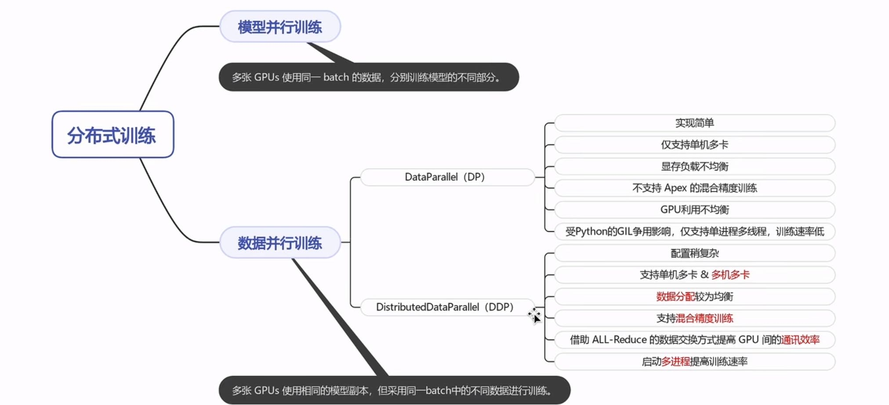
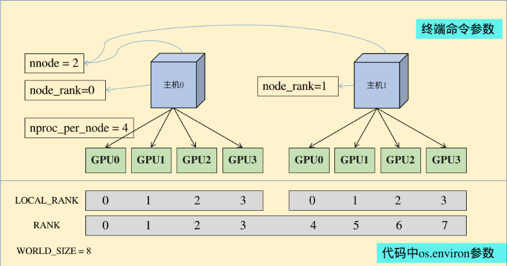

# 分布式训练
该仓库记录基于pytorch提供的DDP的分布式训练的学习笔记；基于DeepSpeed微调大模型的实战项目请参考[QLaw](https://github.com/welchxu/QLaw)

## 目录
**ddp_mp.py** :利用torch.multiprocessing包提供的功能启动分布式训练

**ddp_torchrun.py** :利用torchrun提供的功能启动分布式训练

**ddp_gpus_communication_basic.py**,
**ddp_nccl_communication.py** :分布式训练多进程通信基础


## 基本概念


分布式训练大致分为：模型并行训练和数据并行训练，这里只记录 **数据并行** 训练方法。Pytorch支持两种分布式训练:**DataParallel (DP)** 和**DistributedDataParallel (DDP)**。前者实现简单，只需要在单卡训练模型上添加少量代码即可，但是仅支持单机多卡训练方式，训练过程中只开启一个进程，无法利用多核。多张GPUs中有一个master节点，负责汇总每张卡上的梯度并求梯度均值(master节点必须等待所有节点计算完毕)，计算模型参数后分发到每张卡上，这样会导致GPU利用不均衡等问题；后者启动多个进程，通常每个进程对应一个GPU模型（当然每个进程还能对应多张卡），每个进程跑一份代码，每个进程独立计算模型梯度，进程之间两两通信传递地梯度，然后求梯度均值（AllReduce）。

### node, rank 



* World 是包含所有的分布式训练进程的一个组

* World_size: 组的大小（通常为process数量）

* rank：进程的标志

* local_rank: 在某一结点(node)上的进程标志

* node：节点数目

* node_rank: 节点编号

* nproc_per_node：一个节点中的进程数量，一般一个进程使用一个显卡，故也通常表述为一个节中显卡的数量；

* master_addr：master节点的ip地址，也就是 rank=0 对应的主机地址。设置该参数目的是为了让其他节点知道 0 号节点的位置，这样就可以将自己训练的参数传递过去处理；

* master_port：master节点的port号，在不同的节点上master_addr和master_port的设置是一样的，用来进行通信

**分布式训练一定要记住你写的每一行代码是在多个进程中都要跑一遍的，有些操作是需要同步的！！！**

## 环境

```
torch==2.1.0
```
本实验的数据是随机生成的4096条数据、模型只有一层dense层。在单机多卡（4 * A100-80G GPU）上进行的，当然也支持内存更小的多卡机器。本实验的代码结构简单，提供了注释，可读性强。

## MP
利用pytorch提供的torch.multiprocessing 包启动多进程执行训练脚本
```
python ddp_mp.py --max_epochs=2 --batch_size=32

[W socket.cpp:663] [c10d] The client socket has failed to connect to [localhost]:12345 (errno: 101 - Network is unreachable).
GPU_Count: 4
GPU:0 | Epoch: 0 | Batchsize: 32 | Steps: 32
GPU:2 | Epoch: 0 | Batchsize: 32 | Steps: 32
GPU:1 | Epoch: 0 | Batchsize: 32 | Steps: 32
GPU:3 | Epoch: 0 | Batchsize: 32 | Steps: 32
GPU:0 | Epoch: 1 | Batchsize: 32 | Steps: 32
GPU:2 | Epoch: 1 | Batchsize: 32 | Steps: 32
GPU:3 | Epoch: 1 | Batchsize: 32 | Steps: 32
GPU:1 | Epoch: 1 | Batchsize: 32 | Steps: 32
```
计算： 

Batchsize\*step\*GPU_NUM = 32\*32\*4 = 4096

## torchrun or launch
利用pytorch提供的torchrun 或 torch.distributed.launch 启动多进程执行训练脚本
```
torchrun --nproc-per-node=4 ddp_torchrun.py --max_epoch=2 --batch_size=32

GPU_Count: 4
GPU:2 | Epoch: 0 | Batchsize: 32 | Steps: 32
GPU:3 | Epoch: 0 | Batchsize: 32 | Steps: 32
GPU:1 | Epoch: 0 | Batchsize: 32 | Steps: 32
GPU:0 | Epoch: 0 | Batchsize: 32 | Steps: 32
GPU:3 | Epoch: 1 | Batchsize: 32 | Steps: 32
GPU:2 | Epoch: 1 | Batchsize: 32 | Steps: 32
GPU:1 | Epoch: 1 | Batchsize: 32 | Steps: 32
GPU:0 | Epoch: 1 | Batchsize: 32 | Steps: 32

*****************************************

python -m torch.distributed.launch --use-env --nproc-per-node=4 ddp_torchrun.py --max_epoch=2 --batch_size=32

GPU_Count: 4
GPU:0 | Epoch: 0 | Batchsize: 32 | Steps: 32
GPU:2 | Epoch: 0 | Batchsize: 32 | Steps: 32
GPU:1 | Epoch: 0 | Batchsize: 32 | Steps: 32
GPU:3 | Epoch: 0 | Batchsize: 32 | Steps: 32
GPU:0 | Epoch: 1 | Batchsize: 32 | Steps: 32
GPU:2 | Epoch: 1 | Batchsize: 32 | Steps: 32
GPU:1 | Epoch: 1 | Batchsize: 32 | Steps: 32
GPU:3 | Epoch: 1 | Batchsize: 32 | Steps: 32
```
torchrun 命令 等价于 python -m torch.distributed.launch --use-env

torchrun 将'LOCAL_RANK'设置环境变量中，用户需要从`os.environ('LOCAL_RANK')`中取。


## 进程通信

`ddp_communication_intro.py`
* dist.send() # 向指定设备发送tensor
* dist.recv() # 接收指定设备发送的tensor
* dist.all_reduce() # 将所有的设备上的值按照指定的操作（求和、均值等）聚合,并分发到所有设备上

`torchrun --nproc-per-node=2 ddp_communication.py`
* dist_scatter() # 将某设备上的多个值分发到值分发到多个设备
* dist_gather() # 将多个设备上的值汇聚到指定设备
* dist_broadcast() # 将某设备上的值复制到多个设备
* dist_reduce() # 将所有的设备上的值按照指定的操作（求和、均值）聚合到指定设备上
* dist_all_reduce() #reduce + broacaset
* dist_all_gather() #gather + broacaset
* dist_reduce_scatter() # reduce + scatter


# 参考：
https://tinkerd.net/blog/machine-learning/distributed-training/#the-memory-requirements-of-training

<!-- # 自动混合精度训练
https://pytorch.org/tutorials/recipes/recipes/amp_recipe.html
https://pytorch.org/docs/stable/notes/amp_examples.html -->
